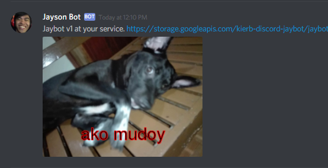

## discord-jaybot
Discord bot that posts random fancy photos of the one and only Jayson.



## Commands
- `!jaybot` &mdash; Help
- `!jaybot go` &mdash; Pick and post a random photo of Jayson
- `!jaybot go hello` &mdash; Pick and post a random photo of Jayson, with "hello" text

## Setup
Requires Node `>v7.10` & npm `>=v5` and GraphicsMagick `>=1.3`.

- Clone the repository and run `npm install`.
- Copy `.env.example` to `.env` and open up `.env`
  - Setup your [bot's token](https://github.com/reactiflux/discord-irc/wiki/Creating-a-discord-bot-&-getting-a-token).
  - Set `DISCORD_BOT_TOKEN` to your bot's token.
  - Create a [Google Cloud Storage](https://cloud.google.com/storage/) bucket.
  - Set `GOOGLE_CLOUD_STORAGE_BUCKET_NAME` to your GCS bucket name.
  - Setup a new folder inside your bucket. The photos will be uploaded here. Don't forget to make the uploaded files public.
  - Set `GOOGLE_CLOUD_STORAGE_SOURCE_DIR` to the created folder.
  - Setup [Google Cloud Storage](https://www.npmjs.com/package/@google-cloud/storage#before-you-begin).
  - Set `GOOGLE_APPLICATION_CREDENTIALS` to the path to your GCS configuration.
- Start the bot with `npm start`.

## Deployment
```js
npm i -g forever
forever node index.js
```

## Overengineered what?
I know, I know. I built this for fun, but I don't want my friend's privacy to suffer. So instead of a static list of photos / urls (which I uploaded to Imgur, initially), I've made things configurable.

Since it's there, I added an image optimization to the mix. I also had some issues with Imgur's API, so I went ahead and switched to Google Cloud Storage since it's free.

Anyway, I love my friends so much I'm willing to use my free day to build rad shit like this. All-in for the memes.
